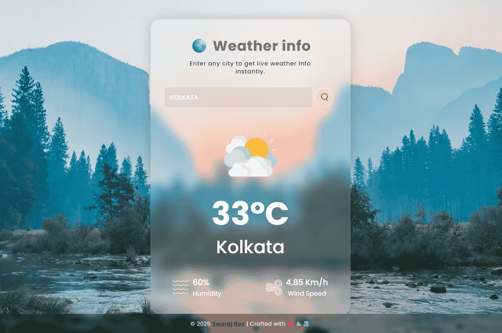

# 🌍 Weather API Web App

A lightweight and responsive weather web application that provides **real-time weather information** for any city worldwide.  
It uses the **OpenWeather API** to fetch live temperature, humidity, wind speed, and weather conditions.  
The app features **dynamic weather icons** that change according to the forecast, with a **modern UI** that works perfectly on all devices.
> 🧑‍💻 Created by [Swaraj Roy](https://github.com/Swarajroy2006)

---

## 📌 Live Project
🔗 **[View Live Demo](https://lab.swaraj.ai.in/Weather-api)**  

---

## 🖼️ Screenshot
  

---

## ✨ Features
- 🌦 **Live Weather Data** — Get real-time temperature, humidity, and wind speed.
- 🖼 **Dynamic Icons** — Weather icons change based on actual conditions (Rain, Snow, Clear, etc.).
- 📱 **Responsive Design** — Works seamlessly on mobile, tablet, and desktop.
- ⚡ **Fast Search** — Search any city worldwide instantly.
- ❌ **Error Handling** — Alerts when an invalid city name is entered.

---

## 🛠️ Technologies Used
- **HTML5**
- **CSS3** (with Glassmorphism UI)
- **JavaScript (ES6)**
- **OpenWeather API**

---

## 📂 Project Structure
<pre>
Weather-api/
│── images/ # Weather icons & assets
│ ├── background.avif
│ ├── clouds.png
│ ├── clear.png
│ ├── drizzle.png
│ ├── rain.png
│ ├── snow.png
│ ├── mist.png
│ ├── wind.png
│ ├── humidity.png
│ └── search.png
│
│── style.css # App styling
│── script.js # Main JS logic
│── config.js # API key config
│── index.html # Main HTML file
│── screenshot.png # App screenshot
│── README.md # Project documentation
└── LICENCE ✅ # License information

</pre>

## 📝 License

This project is licensed under the **MIT License** – feel free to use, modify, and distribute with credit.

📄 [View License](LICENSE)
---
#### [🔗 View on GitHub](https://github.com/Swarajroy2006/Weather-api)

  

